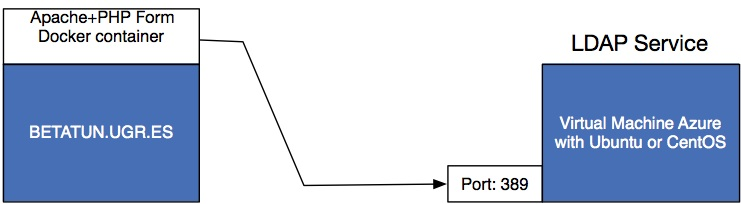

## Schema of the practice




**Objective**:

Create an environment consisting of an MV (S1) in a cloud service containing an LDAP service installed and a container in Betatun.ugr.es (S2) containing a container with a web+php service that includes a web form to authenticate users against S1's LDAP service.


## 1.1 Install OpenLDAP Service (as docker container) on Azure Virtual Machine with CENTOS.

To create a new virtual machine on Azure:

- Install Docker Service
- Once docker is installed, run: ```docker pull larrycai/openldap```
- Then execute: ```docker run -d -p 389:389 --name ldap -t larrycai/openldap```
- Open ports in your Networking policies (389)
- Verify correct set up of LDAP.

```
ldapsearch -H ldap://<IP De tu MV> -LL -b ou=People,dc=openstack,dc=org -x
```

- Add one user and password for this user.


## 1.2 Install OpenLDAP Service on Azure Virtual Machine with CENTOS.

```
[root@dlp ~]# yum -y install openldap-servers openldap-clients
[root@dlp ~]# cp /usr/share/openldap-servers/DB_CONFIG.example /var/lib/ldap/DB_CONFIG 
[root@dlp ~]# chown ldap. /var/lib/ldap/DB_CONFIG 
[root@dlp ~]# systemctl start slapd 
[root@dlp ~]# systemctl enable slapd 
```


### Set OpenLDAP admin password.

```
[root@dlp ~]# slappasswd 
New password:
Re-enter new password:
{SSHA}xxxxxxxxxxxxxxxxxxxxxxxx
```

### Add data to ldiff file:

```
[root@dlp ~]# vi chrootpw.ldif
dn: olcDatabase={0}config,cn=config
changetype: modify
add: olcRootPW
olcRootPW: {SSHA}xxxxxxxxxxxxxxxxxxxxxxxx
```

### Save data for admin user:

```
[root@dlp ~]# ldapadd -Y EXTERNAL -H ldapi:/// -f chrootpw.ldif 
SASL/EXTERNAL authentication started
SASL username: gidNumber=0+uidNumber=0,cn=peercred,cn=external,cn=auth
SASL SSF: 0
modifying entry "olcDatabase={0}config,cn=config"
```

### Import basic Schemas

```
[root@dlp ~]# ldapadd -Y EXTERNAL -H ldapi:/// -f /etc/openldap/schema/cosine.ldif 
SASL/EXTERNAL authentication started
SASL username: gidNumber=0+uidNumber=0,cn=peercred,cn=external,cn=auth
SASL SSF: 0
adding new entry "cn=cosine,cn=schema,cn=config"
```

```
[root@dlp ~]# ldapadd -Y EXTERNAL -H ldapi:/// -f /etc/openldap/schema/nis.ldif 
SASL/EXTERNAL authentication started
SASL username: gidNumber=0+uidNumber=0,cn=peercred,cn=external,cn=auth
SASL SSF: 0
adding new entry "cn=nis,cn=schema,cn=config"
```

```
[root@dlp ~]# ldapadd -Y EXTERNAL -H ldapi:/// -f /etc/openldap/schema/inetorgperson.ldif 
SASL/EXTERNAL authentication started
SASL username: gidNumber=0+uidNumber=0,cn=peercred,cn=external,cn=auth
SASL SSF: 0
adding new entry "cn=inetorgperson,cn=schema,cn=config"
```

#### Set your domain name on LDAP DB.

```
[root@dlp ~]# slappasswd 
New password:
Re-enter new password:
{SSHA}xxxxxxxxxxxxxxxxxxxxxxxx
```

```
[root@dlp ~]# vi chdomain.ldif
# replace to your own domain name for "dc=***,dc=***" section
# specify the password generated above for "olcRootPW" section
 dn: olcDatabase={1}monitor,cn=config
changetype: modify
replace: olcAccess
olcAccess: {0}to * by dn.base="gidNumber=0+uidNumber=0,cn=peercred,cn=external,cn=auth"
  read by dn.base="cn=Manager,dc=srv,dc=world" read by * none

dn: olcDatabase={2}hdb,cn=config
changetype: modify
replace: olcSuffix
olcSuffix: dc=srv,dc=world

dn: olcDatabase={2}hdb,cn=config
changetype: modify
replace: olcRootDN
olcRootDN: cn=Manager,dc=srv,dc=world

dn: olcDatabase={2}hdb,cn=config
changetype: modify
add: olcRootPW
olcRootPW: {SSHA}xxxxxxxxxxxxxxxxxxxxxxxx

dn: olcDatabase={2}hdb,cn=config
changetype: modify
add: olcAccess
olcAccess: {0}to attrs=userPassword,shadowLastChange by
  dn="cn=Manager,dc=srv,dc=world" write by anonymous auth by self write by * none
olcAccess: {1}to dn.base="" by * read
olcAccess: {2}to * by dn="cn=Manager,dc=srv,dc=world" write by * read
```

```
[root@dlp ~]# ldapmodify -Y EXTERNAL -H ldapi:/// -f chdomain.ldif 
SASL/EXTERNAL authentication started
SASL username: gidNumber=0+uidNumber=0,cn=peercred,cn=external,cn=auth
SASL SSF: 0
modifying entry "olcDatabase={1}monitor,cn=config"

modifying entry "olcDatabase={2}hdb,cn=config"

modifying entry "olcDatabase={2}hdb,cn=config"

modifying entry "olcDatabase={2}hdb,cn=config"
```

```
[root@dlp ~]# vi basedomain.ldif
# replace to your own domain name for "dc=***,dc=***" section
 dn: dc=srv,dc=world
objectClass: top
objectClass: dcObject
objectclass: organization
o: Server World
dc: Srv

dn: cn=Manager,dc=srv,dc=world
objectClass: organizationalRole
cn: Manager
description: Directory Manager

dn: ou=People,dc=srv,dc=world
objectClass: organizationalUnit
ou: People

dn: ou=Group,dc=srv,dc=world
objectClass: organizationalUnit
ou: Group
```


```
[root@dlp ~]# ldapadd -x -D cn=Manager,dc=srv,dc=world -W -f basedomain.ldif 
Enter LDAP Password: # directory manager's password
adding new entry "dc=srv,dc=world"

adding new entry "cn=Manager,dc=srv,dc=world"

adding new entry "ou=People,dc=srv,dc=world"

adding new entry "ou=Group,dc=srv,dc=world"
```

#### If Firewalld is running, allow LDAP service. LDAP uses 389/TCP.

```
[root@dlp ~]# firewall-cmd --add-service=ldap --permanent 
success
```

```
[root@dlp ~]# firewall-cmd --reload 
success
```

##  Create LDAP client application in PHP

Go to ``betatun.ugr.es``.

Create in your home folder a folder i.e. ```web```:

```mkdir web```

Create a new container:

```docker run -p 15XXX:80 -v /home/CSXXXXXX/web/:/var/www/html/ --name <your_container_name> -d vaniltonpinheiro/apache-php-ldap```

If your are on ``betatun.ugr.es`` use:


```docker run --privileged -p 14XXX:80 -v /home/cs_XXXXXX/web/:/var/www/html/ --name <your_container_name> -d vaniltonpinheiro/apache-php-ldap```

In this case, we use ``--privileged`` due to SELinux policies on ``betatun.ugr.es``

Go to and check if container is working:

```https://betatun.ugr.es:15XXX/```

Go to the created folder:

```cd /home/CSXXXXXX/web/```

And download authenticacion aplication in PHP:

```wget https://raw.githubusercontent.com/DiCITS/MasterCiberSeguridad/master/extras/authentication.php```

Edit ```authentication.php``` file downloaded and change all occurences:
- server ```betatun.ugr.es```
- port ```15040``` and
- ```dc=openstack,dc=org ```


Change your user password in LDAP docker.ugr.es Service  (if you dont remember):

```ldappasswd -s <newpassword> -W -D "cn=admin,dc=openstack,dc=org" -x "cn=<your_user_name>,ou=Users,dc=openstack,dc=org"```

It'll ask you for the admin ```password```.

Finally, go to :

```https://betatun.ugr.es:15XXX/autentication.php```

Try your credentials, and check if user is **authenticated**.


